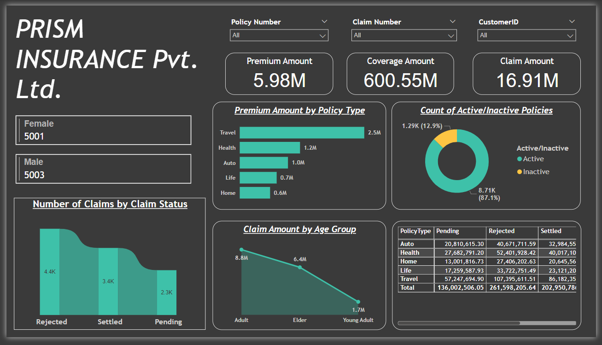
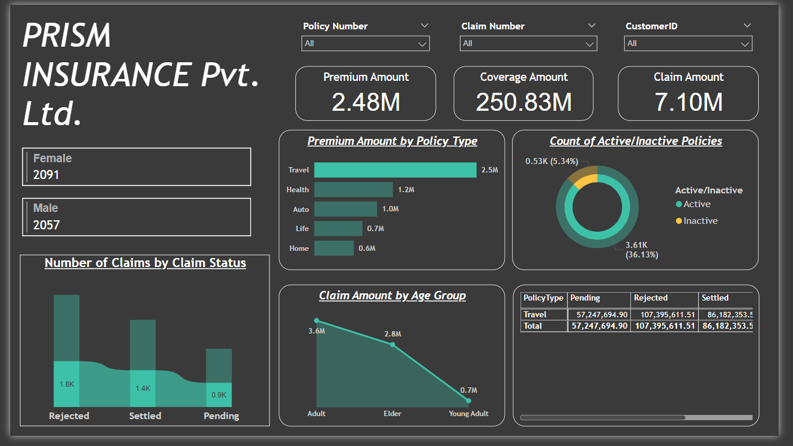
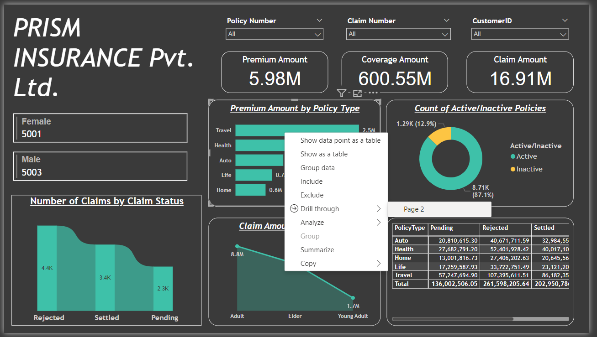

# Prisma Insurance Data Analysis

## Overview

This project features a Power BI analysis of insurance data for Prisma Insurance Pvt. Ltd. The analysis includes various visualizations and insights derived from policy and claim data, leveraging Power BI's capabilities such as DAX (Data Analysis Expressions) and drill-through filters.

## Data Source

The data for this analysis was extracted from Microsoft SQL Server and imported into Power BI Desktop for processing and visualization.

## Key Features

### Visualizations

- **Policy Distribution by Type**: Auto, Health, Home, Life, Travel
- **Claim Status Breakdown**: Rejected, Settled, Pending
- **Premium and Coverage Amounts**
- **Gender Distribution of Policyholders**
- **Age Group Analysis for Claim Amounts**
- **Active vs. Inactive Policy Count**

### DAX Utilization

DAX was used to create calculated columns and measures to enhance the analysis with custom calculations. Examples include:

- **Total Premium Amount**
- **Total Coverage Amount**
- **Total Claim Amount**
- **Claim Ratio**: Claim Amount / Premium Amount

Here's a glimpse of Dashboard that shows the following Observations:

## Key Observations

1. The company maintains a strong financial buffer, with a premium amount of $5.98M, coverage amount of $600.55M, and claim amount of $16.91M.
   
2. Gender distribution is nearly equal, with 5,001 female and 5,003 male policyholders, indicating balanced market reach.

3. A higher number of rejected claims (4.4K) compared to settled claims (3.4K) suggests potential issues in claims processing or policy terms.

4. Travel insurance is the most significant revenue generator with $2.5M in premiums, indicating a strategic focus area for further growth.

5. Adults and young adults account for the majority of claims, highlighting the need for targeted risk management strategies for these age groups.

### Drill-Through Filters

Drill-through functionality allows users to navigate from summary views to detailed information. Examples include:

- Drilling from policy type to individual policy details. This is how it looks like for one type of policy;
  1. **Selecting 'Travel' as Policy Option:**
    
  2. **Right click through ' Drill Through' Option:**
    
  3. **Filtered Data shown on the next page:**
    

- Exploring claim status details from the overview page

## Streamlining and Version Control

### Power BI Services

The report can be further streamlined using Power BI Services:

- Publish the report to Power BI Service for easier sharing and collaboration
- Set up scheduled data refreshes to keep the report up-to-date
- Utilize Power BI Apps for organized distribution to end-users

### Row-Level Security (RLS)

Implement RLS in Power BI Services to ensure data privacy and security:

- Create roles based on user responsibilities (e.g., regional managers, department heads)
- Apply filters to limit data visibility based on user roles
- Test and validate RLS implementation before deploying to production

### Azure Integration

Leverage Azure services for enhanced capabilities:

- Use Azure Analysis Services for large-scale data modeling
- Implement Azure Data Factory for advanced ETL processes
- Utilize Azure Synapse Analytics for big data analytics

### Version Control with Git

Incorporate Git for robust version control:

- Store Power BI files (.pbix) in a Git repository
- Use branches for developing new features or experiments
- Implement pull requests for peer review before merging changes
- Utilize Git tags for marking release versions

## Conclusion
These insights underscore the company's financial health, balanced customer distribution, and opportunities to optimize claims processing and product offerings.

 
